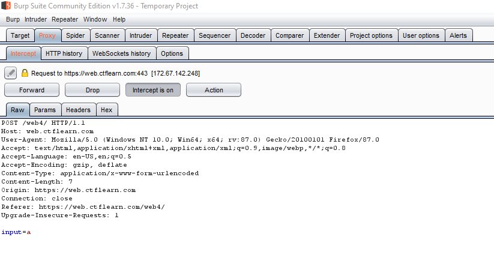

# Lesson 6 - SQL Injection
There are many different types of SQL injection, including:

* Retrieving hidden data
* Subverting application logic
* UNION attacks
* Examining the database
* Blind SQL injection
* SQL truncation attack
* And many more!

## How SQL Injection Works
SQL injection is based on **providing input that manipulates the query** run on the server. Understanding *how* the SQL query is set up is essential to understanding how to manipulate it. Let's take this query that you can see on authentication_bypass.html (you can try this yourself on the HTML page):


If we insert the username `user` and the password `123456`, this SQL query will be run:

```
SELECT * 
FROM users 
WHERE username = 'user'
AND password = '123456'
LIMIT 1     
```

If that's not a valid username and password combination, then you will not get any results back and you won't be authenticated. However, look at what happens if we insert `user'` and `123456`:

```
SELECT * 
FROM users 
WHERE username = 'user''
AND password = '123456'
LIMIT 1     
```

Our SQL query will throw an error because after 'user', you have an additional apostrophe ' that ends before 123456 and it doesn't know what to do with this double string. There are different types of comments in SQL queries, one of which is a double dash `--`. Note what happens if we input `user'--` and no password:

```
SELECT * 
FROM users 
WHERE username = 'user'--'
AND password = ''
LIMIT 1     
```

Everything after `'user'` doesn't matter since there's a comment, so the SQL query *will* return a result, and you'll be authenticated. You didn't even need to know the password! This is one example of **subverting application logic**.

## How to Identify SQL Injectable pages
There are several different ways, but placing a single quote `'`, double quote `"`, or backtick ` in a field is a good test. If you are returned an error, that's a strong indication that it's SQL injectable. 

## Retrieving Hidden Data
A great example of retrieving hidden data is explained on [portswigger.net](https://portswigger.net/web-security/sql-injection). Let's imagine that you're on a website and when you click on a button that says "Gifts", it brings you here to show you all the products that are gifts (you can try this yourself at hidden_data.html):

```
https://insecure-website.com/products?category=Gifts
```

This is the SQL query run on the database when you go to that link:

```
SELECT * FROM products WHERE category = 'Gifts' AND released = 1
```

Released as `1` means that it only shows products that are currently released. If you decided to go to `https://insecure-website.com/products?category=Gifts'--`, then this query would be run:

```
SELECT * FROM products WHERE category = 'Gifts'--' AND released = 1
```

This would bypass the `released` argument and all products would be shown, whether they should be or not.

Also consider this input: `https://insecure-website.com/products?category=Gifts'+OR+1=1--`

```
SELECT * FROM products WHERE category = 'Gifts' OR 1=1--' AND released = 1
```

This SQL query would return all products in **all** categories, since the boolean statement `category = 'Gifts' OR 1=1` will **always** return true.

## Burp Suite
Burp Suite is a tool provided by Port Swigger that allows you full control over sending and receiving HTTP(s) requests, and it allows you to view a lot of the details that you wouldn't normally find. You may find that your version of Burp Suite is different from mine - I've chosen to use an older version since it includes a feature called a "Spider" that will actively crawl a website, but this isn't necessary. In fact, there is a built-in browser in Burp Suite that allows you to use a sort of GUI to navigate to your desired request. 

I'm going to show you how to use Burp Suite through the introductory SQL injection challenge on CTFlearn accessible [here](https://web.ctflearn.com/web4/). Make sure the "Intercept" option is off for now - we want to be able to navigate to our website. To use the browser, go to the Proxy tab and click on the "Open Browser" button next to Action (note - mine doesn't have it, but yours does. You can also set up Firefox or Chrome to work through Burp Suite, but this is much easier). Go ahead and type in the URL for the SQLi challenge above. 


Now that we're here, we see a form that can be submitted. Let's type something into it, but before we submit, go back to Burp Suite and turn "Intercept" on. Then go ahead and submit the form. You'll notice that the browser keeps loading but nothing happens - this is because Burp Suite caught the HTTP request before it went out, so obviously no response was received.



You'll notice that your Proxy tab is orange, meaning it caught the request. It's not very useful here, so right click on any of the text and select the option "Send to Repeater". The Repeater is what will allow us to modify the request however we want. 


Here in the repeater, you can edit the raw HTTP request being sent. There's a lot of information there, including many different headers. A comprehensive list of HTTP headers and what they mean [can be found here](https://developer.mozilla.org/en-US/docs/Web/HTTP/Headers). What we're mainly going to worry about here is the POST data found at the bottom. Currently, it only shows what I put into the field earlier - the `a` character. Let's put in a basic SQL command see what we can find. I'm going to put `a' OR 1=1-- -`. Since we already know the query run, this should return all the results. 


It was a success! We will find the flag listed in our results. Now, you can go to [CTFlearn.com](https://ctflearn.com/challenge/88), sign up for an account, and submit the flag for some ponits. CTFlearn is a great resource for beginners, and it has lots of challenges that give you a good look into a variety of topics. 

## SQLmap
To demonstrate how to use sqlmap, we're going to attempt to solve the first level in OverTheWire's Red Tiger lab (found [here](https://redtiger.labs.overthewire.org/level1.php)). We want to find the login (username and password) for Hornoxe, which is found in the level1_users table. They've given us a lot of information that we wouldn't normally have, but we'll take it!

Let's open it up in Burp Suite. It looks like the username and password fields are submitted using POST (thankfully), so let's inject some apostrophes (`'`) to see what happens. We get the same message if we inject apostrophes or not, so let's try it on the hidden login parameter. It looks like that isn't working either :(


Now, it also seems like there's a GET parameter for some random category.... Let's take a look at that! Instead of trying a bunch of things in Burp Suite, let's move to sqlmap, which can automate all the attacks for us. If you run `sqlmap -h`, it shows you all sorts of options that you can use - it's very powerful. I'm going to run the basic command `sqlmap -u https://redtiger.labs.overthewire.org/level1.php?cat=1 -p cat`. The `-u` specifies the host, and the `-p` specifies the parameter. Since we haven't told it to use a specific technique (ie boolean-based, union, etc.), it's going to try a whole bunch until it finds one. See the output of the command below:


It worked! We have successfully found a way to get information. You can include more tests if you'd like to search for other methods of injection, but since we know this one works, let's stick with it. If you see at the bottom of the output (not pictured above), it gives you the database version (MySQL >=5.0.12) and some of the specific queries ran to get information. 

Now, we want to enumerate all the information we can get our hands on, so let's see what's available. Let's run the command `sqlmap -u https://redtiger.labs.overthewire.org/level1.php?cat=1 -p cat --schema` to figure out what schemas are available. 

Our output will show us that it found a schema named `hackit`, but it couldn't figure out how many tables there are or what their names are. Luckily, though, we were given a table name, so we can use that. Using the information we have available, let's see if we can figure out what the column names are. I'm going to use the command `sqlmap -u https://redtiger.labs.overthewire.org/level1.php?cat=1 -p cat -D hackit -T level1_users --dump` to dump all the information I can find in that table. 

You may have received a message that it couldn't retrieve the number of columns and a message asking to use the "common column existence check". This basically means it wants to brute force column names based on a list of common column names. Go ahead and do so, using the default wordlist (/usr/share/sqlmap/data/txt/common-columns.txt). You'll quickly find 3 column names - id, username, and title. Since it's going to try 2626 columns and we already have quite a few, we can go ahead and end it early. Now, the password field isn't listed here, but since each user has to login with a password, we're going to guess that password is also a field. 

To enumerate the information with the column names, let's run the command `sqlmap -u https://redtiger.labs.overthewire.org/level1.php?cat=1 -p cat -D hackit -T level1_users --dump --technique=B --threads=10 -C id,title,username,password`. This is kind of a long command now, huh! But we're being very specific about what we want, we want to find all the information from the id, title, username, and password columns from the level1_users table in the hackit schema/database using the Boolean-based technique and 10 threads (to speed it up). Soon you'll get output similar to this:


Fantastic! Now that we have the password for the Hornoxe user, let's go ahead and insert into the website and see what we get. Once we do that, we'll find the password that will grant us access to the next level. Congrats!

## Challenges
Did you enjoy this? Go ahead and see how far you can go on the [Red Tiger labs](https://redtiger.labs.overthewire.org) using the information and tools we've provided you + plenty of Googling! This is just the beginning of SQL injection!
