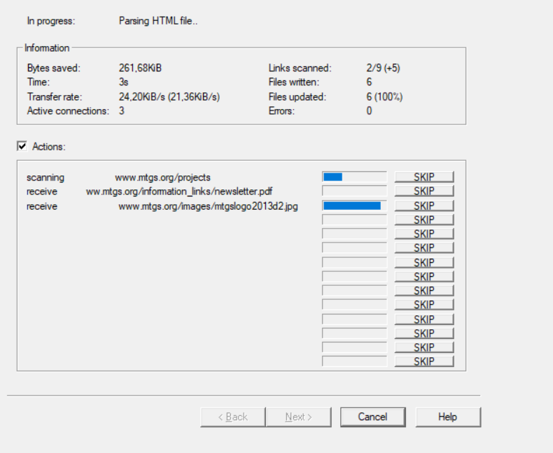

# Lesson 3 - Website Enumeration
Website enumeration is figuring out what pages exist on a website using different methods. We will be covering 3 different methods to enumerate (or find) as many pages on a website as possible. 

## Robots.txt
Whenever you get a result from a search engine (Google, Bing, etc.), the engine pulls data from it's database of indexed pages. How did it get this database? Each search engine has 1 or more crawlers that effectively visit and index information about every webpage they can find. These crawlers are robots that access a page, find all the links on it, and visit each of those pages following the same protocol. 

This can bring up some security issues - what if you want a webpage on your site, but you don't want a search engine crawler to index it, meaning it will never show up in any search engine results? Everyone thinks that [creating a robots.txt page](https://developers.google.com/search/docs/advanced/robots/intro) will do that; it doesn't work very well.

Here's an example robots.txt file:

```
User-agent: Googlebot
Disallow: /nogooglebot/

User-agent: *
Allow: /
```

This robots.txt file, always stored in the base directory (ie https://mywebsite.com/robots.txt), says that Google's crawler called Googlebot (note that Google has multiple crawlers) shouldn't access anything in the /nogooglebot/ directory, but everything else is free game. Any other crawlers can access anything on the site. 

### Issues with robots.txt
First off, the robots.txt file is **just a suggestion**. It's asking the crawlers to follow these rules, but it can't enforce it. In fact, malicious crawlers can access these pages specifically to figure out what little secrets you're trying to hide. So, trying to hide a page by putting it in robots.txt is an **AWFUL** idea because you're practically telling everyone where all your dirty little secrets are. This is why it's *never* a good idea to hide sensitive pages with this - only use robots.txt for nonsensitive pages that you don't want indexed or have too much traffic.

### Example
The flag for a [CTFlearn challenge](https://ctflearn.com/challenge/107) can be found by accessing their [robots.txt page](https://ctflearn.com/robots.txt). 

## Website Crawling
Web crawling is when a crawler/bot/spider reads and copies the contents of every page on a website for archiving or indexing purposes. It does this by going to a page, copying it, extracting links to all the other pages, and then visits those pages and repeats the process. This automates the process so that you can browse a website's files for interesting/suspicious files. However, it's easy for websites to know if you're crawling them - they request tons of pages at an inhuman speed. In some web crawlers, there are options you can specify to throttle the requests and make you seem more legitimate (more like a real person), including spacing out requests, adding in user agents, etc. Some advanced ones will even spoof their IP address using various methods so it looks like the traffic is coming from different sources.

### HTTrack
While there are 1001 different web crawlers out there on the Interwebs (and it's also pretty easy to make your own), one that I will cover is [HTTrack](https://www.httrack.com/). It's free, open-source, has a CLI and GUI, and can be used on Windows or Linux. It's not the most advanced crawler, but it definitely has some nice features and it's pretty easy to use. 

You can [download the Windows version here](https://www.httrack.com/page/2/en/index.html), or install on Linux with the command `sudo apt-get install httrack`. 

Once HTTrack is downloaded and installed, you can start a new project like this:


The default option is to download the entire site, but you can also set it to download that site + every other site it's linked to, update the website that was downloaded previously, or more. If you want to use some of the advanced options for HTTrack, you can click on "Set Options". Some of the options include which file types you want to download, choosing a proxy, request throttling, number of concurrent connections, user agent, and more.

Once the options are set, you can choose to use a VPN if you have one, and then either save the settings to launch later, or launch it right then.

This is what it looks like when you've launched an operation to clone a website:



You can then access the website locally and view all the pages in it. 

Note that large websites take up a lot of storage space, so be careful what you ask for. 

### Web Scraping
Web scraping is a subset of web crawling; web crawling copies the entire website, web scraping only goes through a subset of pages on a website, usually for a specific purpose. Scraping can copy entire pages or directories, or simply access a page and pull out pertinent information that it would like to keep.

My favorite web scraping tool is the Requests library in Python, allowing you to access websites from Python in a very customizable format. We'll hopefully cover this in a later lesson. 

### Example
Looking for an example? Try scraping http://books.toscrape.com/, a website designed for scraping. See what you can find!

## Dirb/DirBuster
Dirb and DirBuster are two applications used to enumerate webpages and web directories by brute-forcing or using dictionaries. Dirb is a command line tool, while DirBuster is a Java-based GUI. Either one works, but we'll cover Dirb today.

### Help and Examples
Here is a screenshot of the help screen for dirb. Notice the examples at the bottom.


### Example
Do you want to find a site to try this on? Try it on Justin's personal website, https://justinapplegate.me. Please note, however, that it's very easy for defenders to notice this traffic since you're sending thousands of HTTP requests to non-existent web pages per minute. 

If it finds a webpage, it just gives you the response code and size of the response. If it finds a directory, it makes a note of it and then restarts the search inside of the directory again. 

You can also specify extensions using the `-X` option and a dictionary to try. My favorite is `/usr/share/dirb/wordlists/common.txt`. The command to try this on Justin's website would then be `dirb https://justinapplegate.me /usr/share/dirb/wordlists/common.txt`.

## Authentication
Hopefully, these 3 different techniques have shown you how *difficult* it is to hide pages on a website. This is why obfuscation isn't secure - although it's harder to find the pages, once someone finds a link to it or brute forces it, the game's over. Always rely on authentication instead of obfuscation. 

Also, just in case you think they'll never your hidden webpage because it's 143 randomly-generated characters, isn't linked anywhere on the web, and isn't on your robots.txt file, there are other methods to find these pages, including extracting your search history on your browser and logging all of the "referrer" sites in your HTTP header. This means that when you visit a website, your browser will tell that new website which site you were on before. So you can be careful, but all it takes is ONE slip up and you lose.