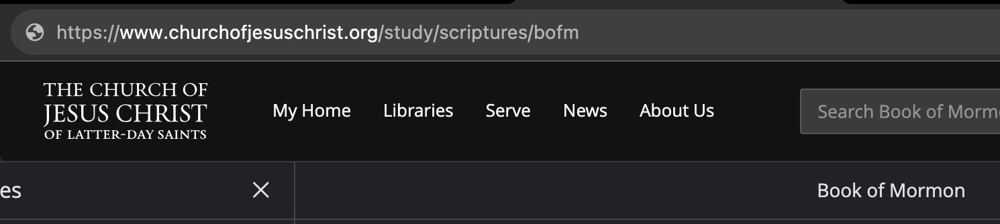

# Lesson 3 - Website Enumeration
When given a web based CTF challenge, your very first step is to do what we call "enumeration". This basically means that you need to analyze and understand your environment to look for weaknesses or clues about the flag.  

### Basic Website Structure

The first critical thing that you need to understand about most websites is that they're organized in a file structure, just like you're used to on your personal computer. The landing page for the website is like the root directory, and all other pages are organized into folders and subfolders. 

Take, for example, [churchofjesuschrist.org](https://www.churchofjesuschrist.org/?lang=eng). If I just go to the main website I only see the domain name in the address bar:


However, if I go to the Book of Mormon page, I can clearly see that I'm in the `bofm` folder, which is in the `scriptures` folder, which is in the `study` folder. 


With this context we can understand that one of our biggest tasks when enumerating websites is discovering every possible page that we can, because we never know which one might hold the flag or vulnerability. This becomes more difficult because unless we have an explicit link to a page (or the website is configured incorrectly) we only see what the site administrator wants us to. 

Unless of course, we're hackers and can get around that ;)

## Common Tools and Strategies

* [robots.txt](https://developers.google.com/search/docs/crawling-indexing/robots/intro)
    * While not a tool in the strictest sense, `robots.txt` is always the first thing we want to try on any website that we're given. The link above can give more details, but essentially robots.txt is a text file placed in the root directory of a website that tells a search engine crawler what pages to index or not. While helpful to reduce traffic on a certain page, trying to hide a page by putting it in `robots.txt` is an **AWFUL** idea because you're practically telling everyone where all your dirty little secrets are. Fortunately for us, lots of websites still do this, so we can find our way directly to sensitive sites by checking `robots.txt`. 
* [Browser Elements Tab](https://webkit.org/web-inspector/elements-tab/)
    * The elements tab allows you to directly view the DOM (Document Access Model) of your web page. Essentially, every element you see on the web page is represented in code in the elements tab. You can also [view the straight up raw source code](https://firefox-source-docs.mozilla.org/devtools-user/view_source/index.html) to get even more information. [This forum post](https://stackoverflow.com/questions/18967324/difference-between-source-code-and-inspect-element) explains the difference. 
* [Browser Console Tab](https://www.javascripttutorial.net/web-development-tools/)
    * Javascript is the client side scripting language of the web, and the console tab is essentially your terminal for it. It is here that you can input JS commands to a web page that you're looking at, or for the purposes of this lesson, you can view any errors or messages that your page generates. 
* [Browser Network Tab](https://developer.chrome.com/docs/devtools/network/)
    * When a modern web page loads, it rarely has all of the resources that it needs to display properly. It often needs to access images, Javascript, CSS, or other files from the web. The network tab keeps track of each request that the existing page makes, which can give you clues about other related sites or even find directories and files that aren't linked elsewhere. 
* [Browser Application Tab](https://developer.chrome.com/docs/devtools/#application)
    * We expect and rely on modern websites to remember who we are when visit them for the first time, or as we navigate across pages. This is only possible because websites often store data inside your browser that allow them to identify you between visits. You always want to be aware of what data this is, as it can give you a clue to finding the flag. 
* [HTTrack](https://www.httrack.com/)
    * HTTrack is an example of a web scraper, a program that will start with a base URL and attempt to download and reconstruct the entire site. It will follow every link on the site recursively, enabling it to find every page that has en explicit link to it. [Cyotek Webcopy](https://www.cyotek.com/cyotek-webcopy/downloads) is another great option that includes the ability to just scan the site. There are tons of these tools out there though, so you can find the one that works best for you (if you're on a Mac good luck tho)
* [Dirb/Gobuster](https://www.kali.org/tools/dirb/)
    * Dirb and Gobuster are tools that can be used to brute force directory and file names using a wordlist. They essentially try to find legitimate file paths where pages are stored by sending HTTP requests using the wordlist as a directory name; if they get anything other than a 404 response then it's likely they found a valid directory. You have to be careful with these tools, 
* [Sublist3r](yeah)
    * Sublist3r is a tool that can help you locate subdomains of a given site. Although a brute force option (called subrute) is available, Sublist3r's real strength comes from checking search engine databases to find subdomains, which means that your target has no idea that you're scanning them. This can help you find sites that are related to your initial one, and owned by the same people, but often hosted elsewhere. 

## Practice Challenges

```md
Insp3ct0r (picoCTF)
--------
Kishor Balan tipped us off that the following code may need inspection: 
https://jupiter.challenges.picoctf.org/problem/9670/

Flag format: picoCTF{flag}
```

```md
Where are the robots? (picoCTF)
--------
Can you find the robots? 
https://jupiter.challenges.picoctf.org/problem/56830/

Flag format: picoCTF{flag}
```

```md
dont-use-client-side (picoCTF)
--------
an you break into this super secure portal? 
https://jupiter.challenges.picoctf.org/problem/17682/

Flag format: picoCTF{flag}
```

## What Next?

* Start enumerating some websites
    * Go to some websites that you visit often, and try the passive recon (not dirb) tactics you just learned. You might be surprised what you find! 
* Do some practice challenges
    * [picoCTF](https://picoctf.org/]) or [Hacker101 CTF](https://ctf.hacker101.com/about) have some great web challenges for you to test your skills on!

### A Note On Authentication
Hopefully, these different techniques have shown you how *difficult* it is to hide pages on a website. This is why obfuscation isn't secure - although it's harder to find the pages, once someone finds a link to it or brute forces it, the game's over. Always rely on authentication instead of obfuscation. 

Also, just in case you think they'll never your hidden webpage because it's 143 randomly-generated characters, isn't linked anywhere on the web, and isn't on your robots.txt file, there are other methods to find these pages, including extracting your search history on your browser and logging all of the "referrer" sites in your HTTP header. This means that when you visit a website, your browser will tell that new website which site you were on before. So you can be careful, but all it takes is ONE slip up and you lose.